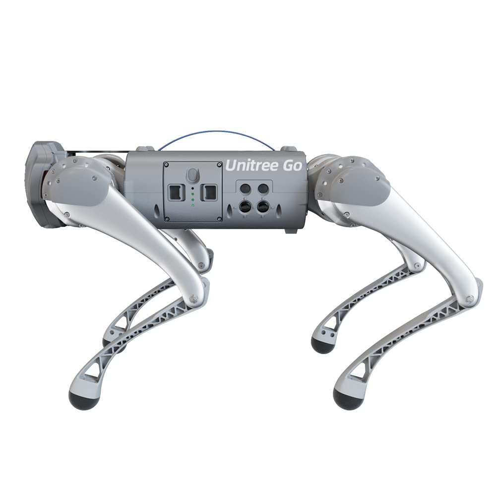
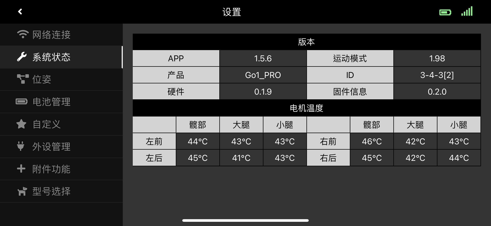
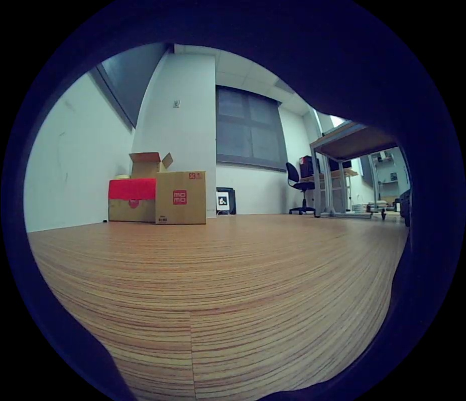
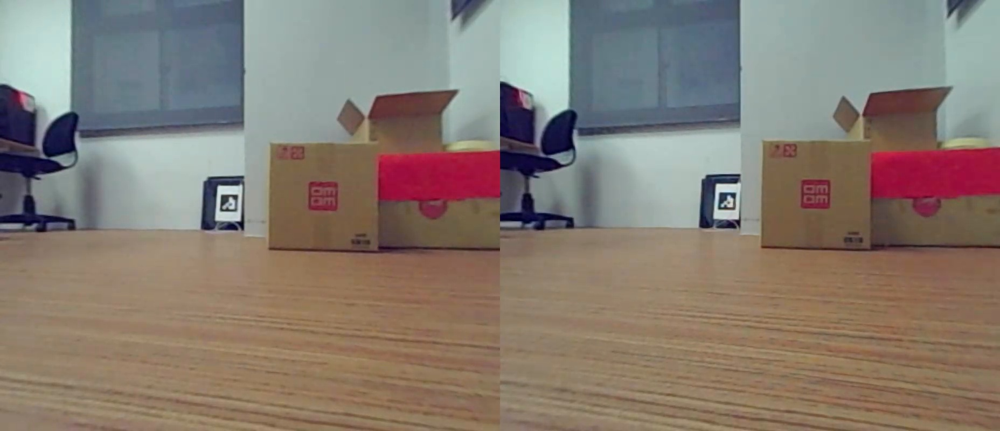
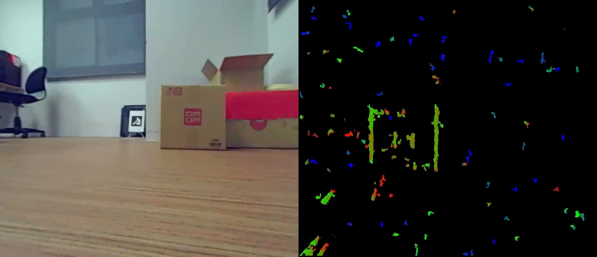

# Unitree Go1 Python Controller
The High-Level python control for Unitree Go1 non-Edu version. HighLevel commands are sent via the MQTT client protocol, while HighState information is received using the UDP protocol.

<div style="text-align: center;">
    
</div>

## Tested
This repository has been tested on real Go1-Pro robot with following firmware version. Moreover, there is no any setting or firmware modification has been applied to robot. It's just turn on the robot, connect laptop to the robot Wi-Fi and run this code.

<div style="text-align: center;">
    
</div>


## Installation
Create a python virtual environment.
```
conda create -n go1 python=3.11
conda activate go1
git clone https://github.com/ahanjaya/unitree-go1-py.git
cd unitree-go1-py/
pip install -r requirements.txt
```

Compile OpenCV from source is mandatory due to gstreamer package requirement. Using pip3 to install opencv-python and opencv-contrib-python will lack dependencies, you must install opencv from source code.
```
conda activate go1
wget -c https://github.com/opencv/opencv/archive/4.10.0.tar.gz
tar -xzvf 4.10.0.tar.gz
sudo mv opencv-4.10.0 /opt
cd /opt/opencv-4.10.0/
mkdir build
cd build/
conda_env_path=~/anaconda3/envs/go1
cmake -D CMAKE_BUILD_TYPE=RELEASE \
      -D OPENCV_GENERATE_PKGCONFIG=YES \
      -D PYTHON3_EXECUTABLE=$conda_env_path/bin/python \
      -D PYTHON3_LIBRARY=$conda_env_path/lib/python3.11 \
      -D PYTHON3_INCLUDE_DIR=$conda_env_path/include/python3.11 \
      -D PYTHON3_PACKAGES_PATH=$conda_env_path/lib/python3.11/site-packages \
      -D BUILD_opencv_python2=OFF \
      -D BUILD_opencv_python3=ON \
      -D INSTALL_PYTHON_EXAMPLES=OFF \
      -D INSTALL_C_EXAMPLES=OFF \
      -D OPENCV_ENABLE_NONFREE=ON \
      -D BUILD_EXAMPLES=OFF ..
make -j32
sudo make install
```

Link the shared library to the conda environment. [Not sure this step is mandatory]
```
cd $conda_env_path/lib/python3.11
ln -s /opt/opencv-4.10.0/build/lib/python3/cv2.cpython-38-x86_64-linux-gnu.so
```
Test opencv whether is sucessfully installed or not.
```
import cv2
cv2.__version__
```

## Usage
```
cd unitree-go1-py/
python main.py
```
---
### Send HighLevel command.

#### Command Velocity
```
go1.set_walk_mode()
go1.walk(Velocity(0.5, 0.0, 0.0)) # X, Y, Theta
```

the other walking gait for velocity control
```
go1.set_run_mode()
go1.set_climb_mode()
```

#### Command Poses
```
go1.set_stand_mode()
go1.Pose(Pose(0.0, 0.0 0.0, 0.5)) # lean_left_right, twist_left_right, look_up_down, extend_squat
```

#### Motions
```
go1.dance_1()
go1.dance_2()
go1.straight_hand()
go1.jump_yaw()
go1.stand_up()
go1.stand_down()
go1.set_damping_mode()
```

#### Set Head LED
```
go1.set_led(LED(255, 255, 255)) # r, g, b
```

---
### Receive HighLevel states
```
go1.high_state.print_states()
```

---
### Stream the camera of Go1 robot.
Please make sure all vision process has been killed in all of the Jetson Nano board before running code. In total there are three Jetson Nano handling the perception of the Go1 robot.

Nano 1 (Head)
```
ssh unitree@192.168.123.13
cd ~/UnitreecameraSDK/
bash killall.sh
./bins/example_putImagetransV1 trans_rect_config_front.yaml
./bins/example_putImagetransV1 trans_rect_config_jaw.yaml
```

Nano 2 (Body)
```
ssh unitree@192.168.123.14
cd ~/UnitreecameraSDK/
bash killall.sh
./bins/example_putImagetransV1 trans_rect_config_left.yaml
./bins/example_putImagetransV1 trans_rect_config_right.yaml
```

Nano 3 (Head)
```
ssh unitree@192.168.123.15
cd ~/UnitreecameraSDK/
bash killall.sh
./bins/example_putImagetransV1 trans_rect_config_belly.yaml
```

You can refer to UnitreeCameraSDK from this [repository](https://github.com/ahanjaya/UnitreecameraSDK) for more information.

---
### Receive camera frame
```
go1.cam_front.latest_frame
go1.cam_jaw.latest_frame
go1.cam_left.latest_frame
go1.cam_right.latest_frame
go1.cam_belly.latest_frame
```
Front camera - Original image.
<div style="text-align: center;">
    
</div>

Front camera - Rect image.
<div style="text-align: center;">
    
</div>

Front camera - Depth image.
<div style="text-align: center;">
    
</div>


## Acknowlegments
Thanks to following repositories:
1. https://github.com/MAVProxyUser/YushuTechUnitreeGo1
2. https://github.com/Bin4ry/free-dog-sdk
3. https://github.com/dbaldwin/go1-js
4. https://unitree-docs.readthedocs.io/en/latest/get_started/Go1_Edu.html
   